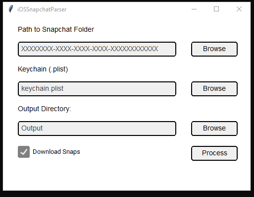

Script is underdevelopment. Script requires WSL and sqlite3 to be installed in WSL.  

Inspired by this article: https://xperylab.medium.com/decrypting-and-extracting-juicy-data-snap-17301aa57a87

Usage:
1. Launch Executable

2. Add Extracted Snapchat Folder from iOS device and Keychain from iOS (necessary for egocipher.key)

3. PROCESS!!!!

Output:
- CSV file:
	- SNAP_ID, Region (From database), Latitude and Longitude, Key, IV, Capture time, Duration, URL, and Format

- Decrypted Gallery Database
- Downloaded Snaps (if selected)
